# Esquema de la Base de Datos: Junior

**Versión:** 2.0
**Fecha:** 2025-10-16

Este documento visualiza la arquitectura de la base de datos del proyecto Junior. Define las tablas principales, sus relaciones y campos importantes para todos los módulos del sistema.

---

## Diagrama de Relaciones (ERD)

```mermaid
erDiagram
    %% ============================================
    %% MÓDULO NÚCLEO - USUARIOS Y PERMISOS
    %% ============================================

    users ||--o{ area_user : "pertenece"
    users ||--o{ role_user : "tiene"
    users ||--o{ task_assignments : "asignado"
    users ||--o{ notifications : "recibe"
    users ||--o{ team_logs : "crea"
    users ||--o{ availability : "define"
    users ||--o{ audit_logs : "genera"
    users ||--o{ campaign_task_assignments : "asignado"

    roles ||--o{ role_user : "asignado"
    roles ||--o{ permission_role : "tiene"

    permissions ||--o{ permission_role : "pertenece"

    areas ||--o{ area_user : "contiene"
    areas ||--o{ tasks : "tiene"
    areas ||--o{ team_logs : "pertenece"
    areas ||--o{ budgets : "gestiona"

    %% ============================================
    %% MÓDULO TAREAS Y COLABORACIÓN
    %% ============================================

    tasks ||--o{ subtasks : "desglosa"
    tasks ||--o{ task_assignments : "asigna"
    tasks }o--|| areas : "pertenece"
    tasks }o--o| tasks : "depende_de"

    subtasks ||--o{ task_assignments : "asigna"

    team_logs }o--|| areas : "pertenece"
    team_logs }o--|| users : "creado_por"

    availability }o--|| users : "pertenece"

    %% ============================================
    %% MÓDULO COMUNICACIÓN Y TRAZABILIDAD
    %% ============================================

    notifications }o--|| users : "destinatario"
    notifications }o--o| areas : "area_destinataria"

    messages }o--|| users : "enviado_por"
    messages }o--o| areas : "area_destinataria"

    audit_logs }o--|| users : "realizado_por"

    %% ============================================
    %% MÓDULO FINANZAS
    %% ============================================

    clients ||--o{ quotes : "recibe"

    cost_catalog ||--o{ quote_items : "usa"
    cost_catalog ||--o{ budget_items : "usa"

    budgets ||--o{ budget_items : "contiene"
    budgets ||--o{ expenses : "registra"
    budgets }o--o| areas : "pertenece"

    budget_items }o--|| budgets : "pertenece"
    budget_items }o--o| cost_catalog : "referencia"

    expenses }o--|| budgets : "afecta"
    expenses }o--|| users : "registrado_por"

    quotes ||--o{ quote_items : "contiene"
    quotes }o--|| clients : "destinatario"
    quotes }o--|| users : "creado_por"

    quote_items }o--|| quotes : "pertenece"
    quote_items }o--o| cost_catalog : "referencia"

    %% ============================================
    %% MÓDULO MARKETING
    %% ============================================

    campaigns ||--o{ campaign_tasks : "incluye"
    campaigns ||--o{ leads : "genera"
    campaigns }o--|| users : "creado_por"

    campaign_tasks ||--o{ campaign_task_assignments : "asigna"
    campaign_tasks }o--|| campaigns : "pertenece"

    campaign_task_assignments }o--|| campaign_tasks : "pertenece"
    campaign_task_assignments }o--|| users : "asignado"

    leads }o--|| campaigns : "origen"
    leads }o--|| users : "registrado_por"

    %% ============================================
    %% DEFINICIÓN DE TABLAS
    %% ============================================

    users {
        bigint id PK
        string name
        string email UK
        timestamp email_verified_at
        string password
        string remember_token
        boolean is_active
        timestamp created_at
        timestamp updated_at
        timestamp deleted_at
    }

    roles {
        bigint id PK
        string name UK
        string slug UK
        text description
        timestamp created_at
        timestamp updated_at
    }

    permissions {
        bigint id PK
        string name UK
        string slug UK
        text description
        string module
        timestamp created_at
        timestamp updated_at
    }

    areas {
        bigint id PK
        string name UK
        string slug UK
        text description
        boolean is_active
        timestamp created_at
        timestamp updated_at
    }

    role_user {
        bigint id PK
        bigint user_id FK
        bigint role_id FK
        bigint area_id FK
        timestamp created_at
        timestamp updated_at
    }

    permission_role {
        bigint id PK
        bigint permission_id FK
        bigint role_id FK
        timestamp created_at
        timestamp updated_at
    }

    area_user {
        bigint id PK
        bigint area_id FK
        bigint user_id FK
        timestamp created_at
        timestamp updated_at
    }

    tasks {
        bigint id PK
        string title
        text description
        bigint area_id FK
        bigint parent_task_id FK
        string priority
        string status
        date due_date
        timestamp completed_at
        timestamp created_at
        timestamp updated_at
        timestamp deleted_at
    }

    subtasks {
        bigint id PK
        bigint task_id FK
        string title
        text description
        string status
        integer order
        timestamp completed_at
        timestamp created_at
        timestamp updated_at
    }

    task_assignments {
        bigint id PK
        bigint assignable_id FK
        string assignable_type
        bigint user_id FK
        timestamp assigned_at
        timestamp created_at
        timestamp updated_at
    }

    team_logs {
        bigint id PK
        bigint area_id FK
        bigint user_id FK
        string title
        text content
        string type
        timestamp created_at
        timestamp updated_at
        timestamp deleted_at
    }

    availability {
        bigint id PK
        bigint user_id FK
        date date
        time start_time
        time end_time
        string status
        text notes
        timestamp created_at
        timestamp updated_at
    }

    notifications {
        bigint id PK
        bigint user_id FK
        bigint area_id FK
        string title
        text message
        string type
        boolean is_read
        timestamp read_at
        timestamp created_at
        timestamp updated_at
    }

    messages {
        bigint id PK
        bigint sender_id FK
        bigint area_id FK
        string subject
        text content
        string type
        timestamp created_at
        timestamp updated_at
    }

    audit_logs {
        bigint id PK
        bigint user_id FK
        string action
        string auditable_type
        bigint auditable_id
        text old_values
        text new_values
        string ip_address
        string user_agent
        timestamp created_at
    }

    clients {
        bigint id PK
        string name
        string email
        string phone
        string company
        text address
        text notes
        boolean is_active
        timestamp created_at
        timestamp updated_at
        timestamp deleted_at
    }

    cost_catalog {
        bigint id PK
        string name
        string code UK
        string category
        decimal unit_cost
        string unit_type
        text description
        boolean is_active
        timestamp created_at
        timestamp updated_at
    }

    budgets {
        bigint id PK
        string name
        string code UK
        bigint area_id FK
        decimal total_amount
        decimal spent_amount
        date start_date
        date end_date
        string status
        text notes
        timestamp created_at
        timestamp updated_at
        timestamp deleted_at
    }

    budget_items {
        bigint id PK
        bigint budget_id FK
        bigint cost_catalog_id FK
        string description
        decimal quantity
        decimal unit_cost
        decimal total_cost
        timestamp created_at
        timestamp updated_at
    }

    expenses {
        bigint id PK
        bigint budget_id FK
        bigint user_id FK
        string description
        decimal amount
        date expense_date
        string category
        text notes
        string receipt_path
        timestamp created_at
        timestamp updated_at
    }

    quotes {
        bigint id PK
        string quote_number UK
        bigint client_id FK
        bigint created_by FK
        decimal total_cost
        decimal profit_margin_percent
        decimal suggested_price
        decimal final_price
        string status
        date valid_until
        text notes
        timestamp created_at
        timestamp updated_at
        timestamp deleted_at
    }

    quote_items {
        bigint id PK
        bigint quote_id FK
        bigint cost_catalog_id FK
        string description
        decimal quantity
        decimal unit_cost
        decimal total_cost
        timestamp created_at
        timestamp updated_at
    }

    campaigns {
        bigint id PK
        string name
        string code UK
        bigint created_by FK
        text description
        text objectives
        date start_date
        date end_date
        string status
        decimal budget
        timestamp created_at
        timestamp updated_at
        timestamp deleted_at
    }

    campaign_tasks {
        bigint id PK
        bigint campaign_id FK
        string title
        text description
        string priority
        string status
        date due_date
        timestamp completed_at
        timestamp created_at
        timestamp updated_at
    }

    campaign_task_assignments {
        bigint id PK
        bigint campaign_task_id FK
        bigint user_id FK
        timestamp assigned_at
        timestamp created_at
        timestamp updated_at
    }

    leads {
        bigint id PK
        bigint campaign_id FK
        bigint registered_by FK
        string name
        string email
        string phone
        string company
        string source
        string status
        text notes
        timestamp created_at
        timestamp updated_at
    }
```

---

## Descripción de Tablas

### MÓDULO NÚCLEO - USUARIOS Y PERMISOS

#### users

**Propósito:** Almacena la información de todos los usuarios de la plataforma.

**Campos importantes:**
- `name`: Nombre completo del usuario
- `email`: Correo electrónico único (usado para login)
- `password`: Hash de la contraseña
- `is_active`: Indica si el usuario está activo o desactivado
- `deleted_at`: Soft delete para mantener historial

**Relaciones:**
- Relación muchos a muchos con `roles` a través de `role_user`
- Relación muchos a muchos con `areas` a través de `area_user`
- Relación uno a muchos con `tasks`, `notifications`, `team_logs`, etc.

---

#### roles

**Propósito:** Define los roles disponibles en el sistema (Dirección General, Director de Área, Miembro de Producción, Admin RRHH, etc.).

**Campos importantes:**
- `name`: Nombre del rol (ej: "Dirección General")
- `slug`: Identificador único en formato slug (ej: "direccion-general")
- `description`: Descripción del propósito del rol

**Relaciones:**
- Relación muchos a muchos con `users` a través de `role_user`
- Relación muchos a muchos con `permissions` a través de `permission_role`

---

#### permissions

**Propósito:** Define permisos granulares que pueden asignarse a roles (ej: "crear_tareas", "ver_finanzas", "gestionar_usuarios").

**Campos importantes:**
- `name`: Nombre descriptivo del permiso
- `slug`: Identificador único en formato slug
- `module`: Módulo al que pertenece el permiso (núcleo, tareas, finanzas, marketing)

**Relaciones:**
- Relación muchos a muchos con `roles` a través de `permission_role`

---

#### areas

**Propósito:** Representa las áreas/departamentos de la empresa (Producción, Marketing, Finanzas, RRHH, etc.).

**Campos importantes:**
- `name`: Nombre del área
- `slug`: Identificador único en formato slug
- `is_active`: Indica si el área está activa

**Relaciones:**
- Relación muchos a muchos con `users` a través de `area_user`
- Relación uno a muchos con `tasks`, `team_logs`, `budgets`

---

#### role_user

**Propósito:** Tabla pivote que permite asignar múltiples roles a un usuario, opcionalmente contextualizados por área.

**Campos importantes:**
- `user_id`: ID del usuario
- `role_id`: ID del rol asignado
- `area_id`: ID del área (nullable) - permite que un usuario tenga el mismo rol en diferentes áreas

**Relaciones:**
- Relación muchos a uno con `users`, `roles` y `areas`

**Nota:** Esta tabla permite la flexibilidad de que un usuario tenga múltiples roles (ej: Director de Producción + Miembro de Marketing).

---

#### permission_role

**Propósito:** Tabla pivote que asigna permisos a roles.

**Campos importantes:**
- `permission_id`: ID del permiso
- `role_id`: ID del rol

**Relaciones:**
- Relación muchos a uno con `permissions` y `roles`

---

#### area_user

**Propósito:** Tabla pivote que define a qué áreas pertenece un usuario.

**Campos importantes:**
- `area_id`: ID del área
- `user_id`: ID del usuario

**Relaciones:**
- Relación muchos a uno con `areas` y `users`

---

### MÓDULO TAREAS Y COLABORACIÓN

#### tasks

**Propósito:** Almacena las tareas principales del sistema. Pueden ser tareas de Dirección hacia Directores, o tareas entre áreas.

**Campos importantes:**
- `title`: Título de la tarea
- `description`: Descripción detallada
- `area_id`: Área a la que pertenece la tarea
- `parent_task_id`: ID de la tarea padre (nullable) - permite jerarquías de tareas
- `priority`: Prioridad (critical, high, medium, low)
- `status`: Estado de la tarea (pending, in_progress, completed, cancelled)
- `due_date`: Fecha límite de entrega
- `completed_at`: Timestamp de cuándo se completó

**Relaciones:**
- Relación muchos a uno con `areas`
- Relación uno a muchos consigo misma para tareas dependientes
- Relación uno a muchos con `subtasks`
- Relación polimórfica uno a muchos con `task_assignments`

---

#### subtasks

**Propósito:** Desglosa tareas principales en subtareas más granulares (ej: un Director desglosa una tarea en pasos para su equipo).

**Campos importantes:**
- `task_id`: ID de la tarea padre
- `title`: Título de la subtarea
- `status`: Estado (pending, in_progress, completed)
- `order`: Orden de la subtarea dentro de la tarea
- `completed_at`: Timestamp de cuándo se completó

**Relaciones:**
- Relación muchos a uno con `tasks`
- Relación polimórfica uno a muchos con `task_assignments`

---

#### task_assignments

**Propósito:** Tabla polimórfica que asigna tareas o subtareas a usuarios específicos.

**Campos importantes:**
- `assignable_id`: ID de la tarea o subtarea
- `assignable_type`: Tipo del modelo (Task o Subtask)
- `user_id`: ID del usuario asignado
- `assigned_at`: Timestamp de la asignación

**Relaciones:**
- Relación polimórfica con `tasks` y `subtasks`
- Relación muchos a uno con `users`

**Nota:** Este diseño polimórfico permite asignar tanto tareas como subtareas a usuarios de forma flexible.

---

#### team_logs

**Propósito:** Bitácora de equipo/área donde los miembros registran decisiones, eventos o notas importantes.

**Campos importantes:**
- `area_id`: ID del área a la que pertenece la entrada
- `user_id`: ID del usuario que creó la entrada
- `title`: Título de la entrada
- `content`: Contenido de la entrada (texto enriquecido)
- `type`: Tipo de entrada (decision, event, note, etc.)

**Relaciones:**
- Relación muchos a uno con `areas` y `users`

---

#### availability

**Propósito:** Calendario de disponibilidad personal para miembros de Producción (u otros que necesiten coordinar horarios).

**Campos importantes:**
- `user_id`: ID del usuario
- `date`: Fecha de disponibilidad
- `start_time`: Hora de inicio
- `end_time`: Hora de fin
- `status`: Estado (available, busy, off)
- `notes`: Notas adicionales

**Relaciones:**
- Relación muchos a uno con `users`

---

### MÓDULO COMUNICACIÓN Y TRAZABILIDAD

#### notifications

**Propósito:** Notificaciones individuales o por área enviadas a usuarios.

**Campos importantes:**
- `user_id`: ID del usuario destinatario (nullable si es notificación por área)
- `area_id`: ID del área destinataria (nullable si es individual)
- `title`: Título de la notificación
- `message`: Contenido del mensaje
- `type`: Tipo de notificación (info, warning, success, error)
- `is_read`: Indica si fue leída
- `read_at`: Timestamp de lectura

**Relaciones:**
- Relación muchos a uno con `users` y `areas`

**Nota:** Una notificación puede ser individual (user_id) o por área (area_id), pero no ambas.

---

#### messages

**Propósito:** Mensajes generales enviados por Dirección o RRHH a toda la empresa o áreas específicas.

**Campos importantes:**
- `sender_id`: ID del usuario que envía el mensaje
- `area_id`: ID del área destinataria (nullable si es mensaje general)
- `subject`: Asunto del mensaje
- `content`: Contenido del mensaje
- `type`: Tipo de mensaje (general, area, announcement)

**Relaciones:**
- Relación muchos a uno con `users` (sender)
- Relación muchos a uno con `areas`

---

#### audit_logs

**Propósito:** Registro de auditoría/trazabilidad para acciones clave del sistema (crear/completar tareas, crear/eliminar bitácoras, etc.).

**Campos importantes:**
- `user_id`: ID del usuario que realizó la acción
- `action`: Tipo de acción (created, updated, deleted, completed, assigned)
- `auditable_type`: Tipo del modelo afectado (Task, TeamLog, User, etc.)
- `auditable_id`: ID del registro afectado
- `old_values`: JSON con valores anteriores (para updates/deletes)
- `new_values`: JSON con valores nuevos (para creates/updates)
- `ip_address`: IP del usuario
- `user_agent`: Navegador/dispositivo del usuario

**Relaciones:**
- Relación muchos a uno con `users`
- Relación polimórfica con cualquier modelo auditable

---

### MÓDULO FINANZAS

#### clients

**Propósito:** Catálogo centralizado de clientes de la empresa.

**Campos importantes:**
- `name`: Nombre del cliente
- `email`: Correo electrónico
- `phone`: Teléfono
- `company`: Empresa del cliente
- `address`: Dirección
- `notes`: Notas adicionales
- `is_active`: Indica si el cliente está activo

**Relaciones:**
- Relación uno a muchos con `quotes`

---

#### cost_catalog

**Propósito:** Catálogo de costos estandarizado (materiales, servicios, mano de obra) usado para calcular presupuestos y cotizaciones.

**Campos importantes:**
- `name`: Nombre del item (ej: "Cemento Portland")
- `code`: Código único del item
- `category`: Categoría (material, service, labor)
- `unit_cost`: Costo por unidad
- `unit_type`: Tipo de unidad (kg, m3, hour, etc.)
- `description`: Descripción del item
- `is_active`: Indica si el item está activo

**Relaciones:**
- Relación uno a muchos con `quote_items` y `budget_items`

---

#### budgets

**Propósito:** Presupuestos asignados a proyectos o áreas para controlar el gasto.

**Campos importantes:**
- `name`: Nombre del presupuesto
- `code`: Código único del presupuesto
- `area_id`: ID del área (nullable si es presupuesto de proyecto)
- `total_amount`: Monto total presupuestado
- `spent_amount`: Monto gastado (calculado desde expenses)
- `start_date`: Fecha de inicio
- `end_date`: Fecha de fin
- `status`: Estado (draft, active, completed, cancelled)
- `notes`: Notas adicionales

**Relaciones:**
- Relación muchos a uno con `areas`
- Relación uno a muchos con `budget_items` y `expenses`

---

#### budget_items

**Propósito:** Items individuales dentro de un presupuesto (desglose del presupuesto).

**Campos importantes:**
- `budget_id`: ID del presupuesto padre
- `cost_catalog_id`: ID del item del catálogo (nullable si es item personalizado)
- `description`: Descripción del item
- `quantity`: Cantidad
- `unit_cost`: Costo unitario
- `total_cost`: Costo total (quantity * unit_cost)

**Relaciones:**
- Relación muchos a uno con `budgets` y `cost_catalog`

---

#### expenses

**Propósito:** Gastos reales registrados contra un presupuesto.

**Campos importantes:**
- `budget_id`: ID del presupuesto afectado
- `user_id`: ID del usuario que registró el gasto
- `description`: Descripción del gasto
- `amount`: Monto gastado
- `expense_date`: Fecha del gasto
- `category`: Categoría del gasto
- `notes`: Notas adicionales
- `receipt_path`: Ruta del comprobante escaneado

**Relaciones:**
- Relación muchos a uno con `budgets` y `users`

---

#### quotes

**Propósito:** Cotizaciones generadas para clientes usando la calculadora de costos.

**Campos importantes:**
- `quote_number`: Número único de cotización
- `client_id`: ID del cliente destinatario
- `created_by`: ID del usuario que creó la cotización
- `total_cost`: Costo total de los items
- `profit_margin_percent`: Margen de ganancia deseado (%)
- `suggested_price`: Precio sugerido por el sistema (total_cost + margen)
- `final_price`: Precio final ofrecido al cliente
- `status`: Estado (draft, sent, accepted, rejected, expired)
- `valid_until`: Fecha de validez de la cotización
- `notes`: Notas adicionales

**Relaciones:**
- Relación muchos a uno con `clients` y `users`
- Relación uno a muchos con `quote_items`

---

#### quote_items

**Propósito:** Items individuales dentro de una cotización.

**Campos importantes:**
- `quote_id`: ID de la cotización padre
- `cost_catalog_id`: ID del item del catálogo (nullable si es item personalizado)
- `description`: Descripción del item
- `quantity`: Cantidad
- `unit_cost`: Costo unitario
- `total_cost`: Costo total (quantity * unit_cost)

**Relaciones:**
- Relación muchos a uno con `quotes` y `cost_catalog`

---

### MÓDULO MARKETING

#### campaigns

**Propósito:** Campañas de marketing con objetivos y fechas definidas.

**Campos importantes:**
- `name`: Nombre de la campaña
- `code`: Código único de la campaña
- `created_by`: ID del usuario que creó la campaña
- `description`: Descripción de la campaña
- `objectives`: Objetivos de la campaña
- `start_date`: Fecha de inicio
- `end_date`: Fecha de fin
- `status`: Estado (planning, active, completed, cancelled)
- `budget`: Presupuesto de la campaña

**Relaciones:**
- Relación muchos a uno con `users` (creator)
- Relación uno a muchos con `campaign_tasks` y `leads`

---

#### campaign_tasks

**Propósito:** Tareas específicas de marketing dentro de una campaña (ej: "Diseñar banner", "Escribir copy").

**Campos importantes:**
- `campaign_id`: ID de la campaña padre
- `title`: Título de la tarea
- `description`: Descripción detallada
- `priority`: Prioridad (critical, high, medium, low)
- `status`: Estado (pending, in_progress, completed, cancelled)
- `due_date`: Fecha límite
- `completed_at`: Timestamp de cuándo se completó

**Relaciones:**
- Relación muchos a uno con `campaigns`
- Relación uno a muchos con `campaign_task_assignments`

**Nota:** Estas tareas se integran con el sistema general de tareas para que los miembros de marketing tengan una vista unificada.

---

#### campaign_task_assignments

**Propósito:** Asignación de tareas de marketing a usuarios específicos.

**Campos importantes:**
- `campaign_task_id`: ID de la tarea de marketing
- `user_id`: ID del usuario asignado
- `assigned_at`: Timestamp de la asignación

**Relaciones:**
- Relación muchos a uno con `campaign_tasks` y `users`

---

#### leads

**Propósito:** Base de datos de prospectos/leads generados por campañas de marketing.

**Campos importantes:**
- `campaign_id`: ID de la campaña que generó el lead
- `registered_by`: ID del usuario que registró el lead
- `name`: Nombre del prospecto
- `email`: Correo electrónico
- `phone`: Teléfono
- `company`: Empresa del prospecto
- `source`: Fuente del lead (web, event, referral, etc.)
- `status`: Estado (new, contacted, qualified, converted, lost)
- `notes`: Notas adicionales

**Relaciones:**
- Relación muchos a uno con `campaigns` y `users`

---

## Índices y Optimizaciones

### Índices Recomendados:

- **Tabla `users`:**
  - Índice único en `email`
  - Índice en `is_active` para filtrado rápido

- **Tabla `roles`:**
  - Índice único en `slug`

- **Tabla `permissions`:**
  - Índice único en `slug`
  - Índice en `module` para filtrado por módulo

- **Tabla `areas`:**
  - Índice único en `slug`
  - Índice en `is_active`

- **Tabla `role_user`:**
  - Índice compuesto en `(user_id, role_id, area_id)` para evitar duplicados
  - Índice en `user_id` para consultas de roles por usuario
  - Índice en `role_id` para consultas de usuarios por rol

- **Tabla `tasks`:**
  - Índice en `area_id` para filtrado por área
  - Índice en `status` para filtrado por estado
  - Índice en `due_date` para ordenamiento por fecha
  - Índice en `parent_task_id` para tareas dependientes

- **Tabla `task_assignments`:**
  - Índice compuesto en `(assignable_type, assignable_id)` para relación polimórfica
  - Índice en `user_id` para consultas de tareas por usuario

- **Tabla `audit_logs`:**
  - Índice compuesto en `(auditable_type, auditable_id)` para relación polimórfica
  - Índice en `user_id` para filtrado por usuario
  - Índice en `created_at` para ordenamiento cronológico

- **Tabla `notifications`:**
  - Índice compuesto en `(user_id, is_read)` para notificaciones no leídas
  - Índice en `area_id` para notificaciones por área

- **Tabla `budgets`:**
  - Índice único en `code`
  - Índice en `area_id` para filtrado por área
  - Índice en `status` para filtrado por estado

- **Tabla `quotes`:**
  - Índice único en `quote_number`
  - Índice en `client_id` para consultas por cliente
  - Índice en `status` para filtrado por estado

- **Tabla `campaigns`:**
  - Índice único en `code`
  - Índice en `status` para filtrado por estado

---

## Notas de Implementación

### Gestión de Archivos:
- **Recibos de Gastos:** Se usará el sistema de storage de Laravel para almacenar comprobantes en `expenses.receipt_path`
- **Futuras expansiones:** Considerar Spatie Media Library si se requiere gestión avanzada de archivos

### Soft Deletes:
Las siguientes tablas implementan soft deletes (`deleted_at`) para mantener integridad referencial:
- `users`
- `tasks`
- `team_logs`
- `clients`
- `budgets`
- `quotes`
- `campaigns`

### Timestamps:
Todas las tablas incluyen `created_at` y `updated_at` excepto `audit_logs` que solo tiene `created_at` (es un log inmutable).

### Campos JSON:
- `audit_logs.old_values` y `audit_logs.new_values`: Almacenan snapshots JSON de los cambios para trazabilidad

### Sistema de Permisos:
El sistema implementa permisos **aditivos**:
- Un usuario puede tener múltiples roles
- Cada rol puede tener múltiples permisos
- Los permisos se acumulan (si un rol tiene permiso X y otro rol tiene permiso Y, el usuario tiene X + Y)

### Relaciones Polimórficas:
- `task_assignments`: Permite asignar tanto `tasks` como `subtasks` a usuarios
- `audit_logs`: Permite auditar cualquier modelo del sistema

### Integridad Referencial:
- Todas las relaciones FK deben tener `onDelete` adecuado:
  - Tablas pivote: `cascade` (si se elimina el padre, eliminar la relación)
  - Tablas dependientes: `restrict` o `set null` según el caso de negocio
  - Soft deletes: mantener FKs intactas

---

## Historial de Cambios

**Versión 2.0 - 2025-10-16:**
- Diseño completo del esquema de base de datos para el MVP
- Implementación de módulos: Núcleo, Tareas, Comunicación, Finanzas y Marketing
- Sistema flexible de roles y permisos con soporte multi-área
- Soporte para tareas polimórficas y jerarquías de tareas
- Sistema de trazabilidad/auditoría completo
- Módulo de Finanzas con catálogo de costos, presupuestos y cotizaciones
- Módulo de Marketing con campañas, tareas y leads

---

## Siguientes Pasos

1. **Sprint 0:** Crear las migraciones de Laravel basadas en este esquema
2. **Sprint 0:** Implementar los modelos Eloquent con sus relaciones
3. **Sprint 0:** Crear los seeders para roles, permisos y áreas iniciales
4. **Sprint 0:** Configurar el sistema de autenticación con Laravel Breeze/Jetstream
5. **Sprint 1-4:** Implementar la lógica de negocio según las historias de usuario

---

**Notas Finales:**

Este esquema está diseñado para ser **flexible y escalable**. El sistema de roles y permisos permite que un usuario tenga múltiples roles en diferentes áreas, reflejando la realidad de las organizaciones modernas donde las personas desempeñan múltiples funciones.

El diseño sigue las mejores prácticas de Laravel y normalización de bases de datos, garantizando integridad referencial y performance óptimo a través de índices estratégicos.